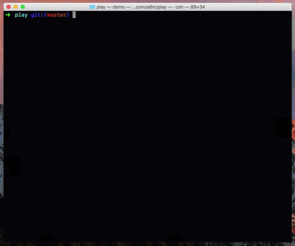

# play

Play something while waiting for your command to finish.

Sometimes, you run a program that takes a few seconds (or minute), and you don't really want to do other things while it's running. so instead of sitting there and staring at the screen, play something.
__How do you do it?__ _just prefix your command with `play`_.


<p align="center">
  
</p>


## Installation

```
go get -u github.com/a8m/play
```

## Usage

```
$ play program arg1 arg2...
```

## Things I wanna add
- [ ] More games, like: Chrome's dinosaur, Snake
- [ ] Twitter, and news
- [ ] Small math and CS puzzles
- [ ] Read blog posts, and papers
